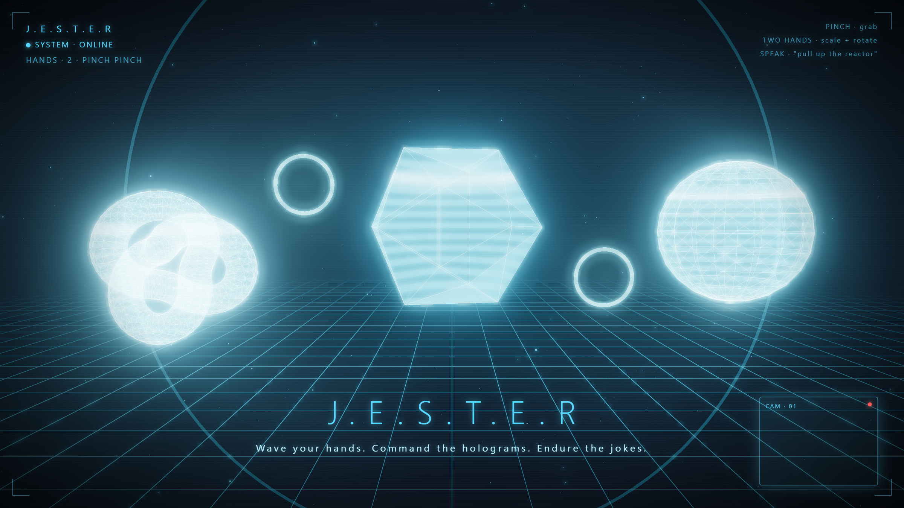

# J.E.S.T.E.R — Holographic Interface



A browser-based Iron Man interface: control 3D holograms with your bare hands via
webcam hand-tracking, and command a voice-driven JESTER assistant that both talks
back and reshapes the display.

Two ways to run it:

- **Solo** — everything on one machine (laptop webcam controls the holograms).
- **Phone controller** 🔥 — your **phone** tracks your hands and streams them to a
  **big screen** where the holograms live. You stand back and conduct the display,
  Tony-Stark style.

No special hardware — just a webcam (or phone), and Chrome.

## What it does

- **Pinch to grab** a hologram and move it; **two-handed pinch** to scale (hand
  distance) and rotate (hand angle).
- **Speak to JESTER** — it replies in a synthesized voice *and* acts on the display:
  spawn / dismiss / rotate / scale holograms and reposition its own avatar.
- **3D media carousel** — scroll your photos & videos with hand gestures, pinch to
  focus, open thumb + index to open one.
- **Voice web / YouTube search** — JESTER types the query into the browser, pulls
  thumbnails into an in-app gallery, then you pick by voice ("play number two").
- **Control your PC** (via the desktop overlay) — "open Spotify", play / pause,
  next track, volume, fullscreen, minimize, launch / close apps, lock the PC.
- **"JESTER, hide"** drops it to standby until you say the wake word again.
- **"What are you built with?"** triggers an animated **3D tech-stack reveal** — a
  floating arc of holographic emblems, one true to each technology.

## Commands

Just talk to JESTER — one model call maps your phrasing to a structured action
(`server/jester.js`, `perform_action`). You don't have to say these verbatim; the
examples are just the intent.

| Say something like… | Action | `command` |
| --- | --- | --- |
| "pull up the reactor" / helmet / globe / cube | spawn a hologram | `spawn` |
| "dismiss that" / "get rid of everything" | remove one / all | `dismiss` |
| "reset the scene" | clear all holograms | `reset` |
| "rotate that" / "spin it" | rotate the last hologram | `rotate` |
| "make it bigger / smaller" | scale the last hologram | `scale` |
| "move to the top-left" (also center, left, right, …) | reposition the JESTER avatar | `move` |
| "search YouTube for lo-fi beats" / "google …" | web / YouTube search, thumbnails + pick by voice | `web_search` |
| "open youtube.com" | open a URL in the browser | `open_url` |
| "open Spotify" / Discord / Chrome … | launch an app | `launch_app` |
| "close Spotify" | close an app | `close_app` |
| "hide that out of my way" | minimize the app you just opened | `hide_app` |
| "show the desktop" | minimize everything | `show_desktop` |
| "lock the PC" | lock Windows | `lock_pc` |
| "play" / "pause" | play-pause (Spotify or video) | `play_pause` |
| "next track" / "previous track" | skip / back | `next_track` / `previous_track` |
| "volume up" / "volume down" / "mute" | system volume | `volume_up` / `volume_down` / `mute` |
| "fullscreen" / "minimize" / "maximize" | window control (minimize also exits fullscreen) | `fullscreen` / `minimize` / `maximize` |
| "JESTER, hide" / "go dark" | standby until you say the wake word "JESTER" | `hide` |
| "what are you built with?" | animated 3D tech-stack reveal | `tech_stack` |

> App / media / window / lock commands run through the **desktop overlay**
> (`npm run app`), which is where JESTER can touch the OS. In the plain browser
> build, the hologram, avatar, search, and tech-stack commands still work.

## The interesting code

Built around small, readable engines:

- **`src/interaction/controller.js`** — the gesture→transform engine. A stateless
  per-frame `update(hands)` mapping pinches onto grab / move / scale / rotate. The
  two-hand transform (scale from hand distance, rotation from hand angle) is ~30 lines.
- **`src/voice/jester.js` + `server/jester.js`** — the say-and-act pipeline. One
  model call returns both a spoken line (streamed to TTS) and a structured scene
  command (function calling), so voice and hands drive the *same* scene API.
- **`server/jester.js` (WebSocket relay) + `src/net/link.js`** — a pure room-based
  relay that pairs a phone controller with a display.

The display renders identically whether hands come from a local camera or a phone
over the wire — the input source is abstracted behind one `hands` array.

## Stack

- **Hand tracking:** MediaPipe Tasks Vision (`HandLandmarker`), 21 landmarks/hand.
- **Rendering:** three.js + a custom holographic shader + Unreal bloom post-processing.
- **Voice:** OpenAI end-to-end — `gpt-4o-transcribe` (speech-to-text) and
  `gpt-4o-mini-tts` (voice "ash"), with barge-in so you can talk over it.
- **Brain:** OpenAI `gpt-4o-mini` via a tiny Express proxy — one call returns both
  a spoken line and a structured scene/PC action (function calling).
- **Desktop overlay:** an Electron shell ("mainframe") that floats JESTER over the
  live desktop and routes voice commands to OS control (media keys, app launch, …).
- **Pairing:** WebSocket relay (phone → display), stable room code.

## Run it — solo

```bash
npm install
cp .env.example .env      # paste your OpenAI key into .env
npm start
```

Open **http://localhost:3000** in Chrome → **Initialize Display** → click
*"use this device's camera instead"*. Allow camera + mic.

## Run it — phone controller (the cool one)

Phone cameras require **HTTPS** (browsers block camera access on plain `http`), so
you need a public HTTPS URL to your local server. Easiest, zero-account option:

```bash
npm start
# in another terminal:
npx cloudflared tunnel --url http://localhost:3000
```

This prints an `https://…trycloudflare.com` URL. Then:

1. Open that **HTTPS URL on the big screen** (laptop/TV) → **Initialize Display**.
   A **QR code** appears.
2. **Scan the QR with your phone** (it opens the controller over the same HTTPS URL).
   Tap **Start Tracking**, allow the camera.
3. Prop the phone up so it sees both hands — you're now controlling the display.
   Tap the phone's 🎤 to give voice commands.

> **Phone note:** the phone records mic audio and sends it to the server's `/stt`
> endpoint (OpenAI `gpt-4o-transcribe`), so voice works on any phone — no reliance
> on the browser's Web Speech. (Tailscale Funnel works as an HTTPS tunnel too:
> `tailscale funnel 3000`.)

## Desktop overlay — "enter the mainframe"

```bash
npm run app        # launches the Electron shell
```

An Electron window floats JESTER as a **transparent overlay over your live
desktop**. Say *"enter the mainframe"* (or `Ctrl+Shift+M`) and JESTER tucks into a
corner, listens hands-free, and controls your PC by voice — open apps, media keys,
volume, fullscreen, web/YouTube search, lock. `Escape` exits the overlay.

## Architecture

```
PHONE                       SERVER                           DISPLAY (big screen)
camera ▶ MediaPipe ▶ hands ─┐
mic ▶ record ▶ /stt ────────┤  gpt-4o-transcribe → transcript
                            ├▶ /ws relay  ▶ hands ▶ controller ▶ holograms
                            ├▶ /jester    ▶ gpt-4o-mini     ▶ spoken line + action
                            └▶ /tts       ▶ gpt-4o-mini-tts ▶ voice (played on display)
```

## Tuning

- Grabbing feels reversed? Flip `MIRROR` in `src/interaction/space.js`.
- Pinch too sensitive? Adjust the `0.35` threshold in `src/hands/gestures.js`.
- Bloom too strong/weak? Tune the `UnrealBloomPass` args in `src/scene/objects.js`.
- Wittier JESTER? Swap `MODEL` to `gpt-4o` in `server/jester.js`.
- Real 3D models? Replace the factories in `src/scene/objects.js` with a GLTF loader.
